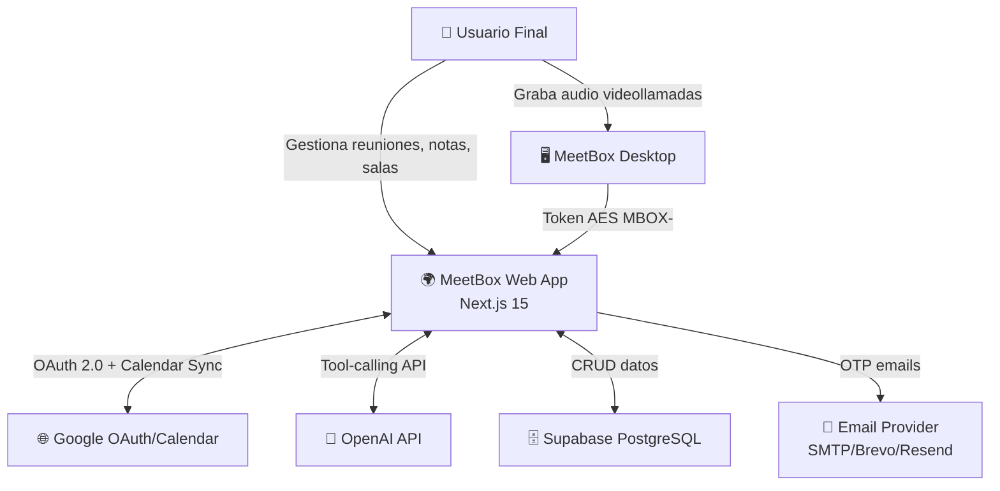
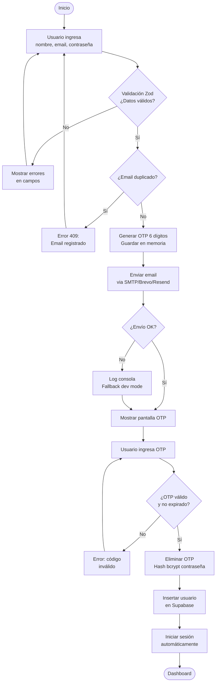
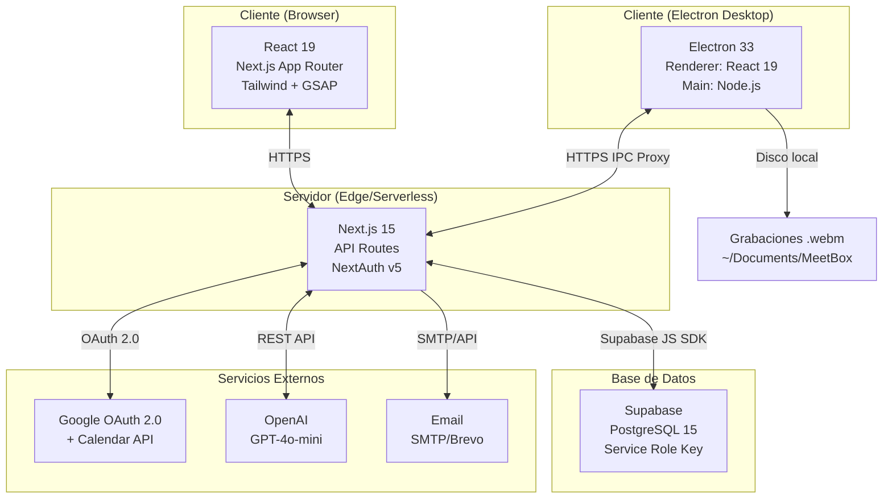
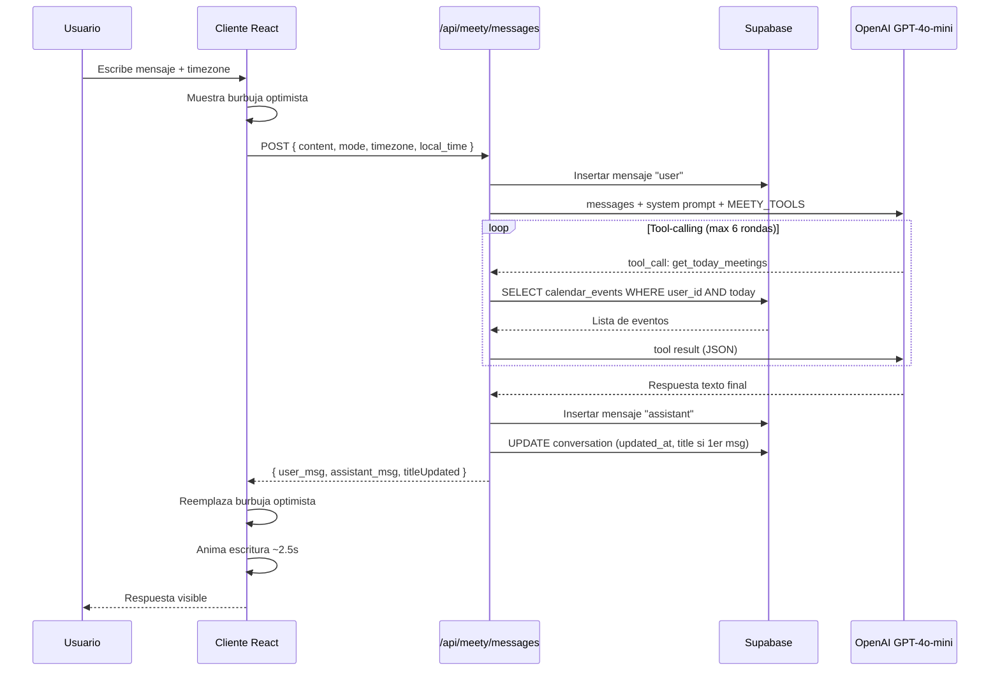

# LEVANTAMIENTO COMPLETO DE PROYECTO — MEETBOX
**Documento de Análisis, Requisitos y Planificación Ágil**
**Versión:** 1.0 | **Fecha:** 2026-06-04 | **Clasificación:** Interno — Uso del Cliente
**Referencia normativa:** IEEE 830 · BABOK v3 · Scrum Guide 2020 · PMBOK 7ª ed.

---

## ÍNDICE

1. [Resumen Ejecutivo](#1-resumen-ejecutivo)
2. [Objetivo General SMART](#2-objetivo-general)
3. [Objetivos Específicos SMART](#3-objetivos-específicos)
4. [Stakeholders](#4-stakeholders)
5. [Alcance Funcional — Módulos](#5-alcance-funcional)
6. [Requisitos Funcionales](#6-requisitos-funcionales)
7. [Requisitos No Funcionales](#7-requisitos-no-funcionales)
8. [Historias de Usuario](#8-historias-de-usuario)
9. [Casos de Uso](#9-casos-de-uso)
10. [Matriz de Trazabilidad](#10-matriz-de-trazabilidad)
11. [Restricciones del Proyecto](#11-restricciones-del-proyecto)
12. [KPIs del Proyecto](#12-kpis-del-proyecto)
13. [Métricas de Calidad](#13-métricas-de-calidad)
14. [Definición de Roles](#14-definición-de-roles)
15. [Planificación Ágil — Product Backlog](#15-planificación-ágil)
16. [Sprint Planning](#16-sprint-planning)
17. [Asignación de Equipo](#17-asignación-de-equipo)
18. [Diagramas Textuales](#18-diagramas-textuales)
19. [Riesgos](#19-riesgos)
20. [Conclusiones](#20-conclusiones)

---

## 1. RESUMEN EJECUTIVO

### Descripción del Proyecto

**MeetBox** es una plataforma web de gestión integral de reuniones orientada a equipos de trabajo. Combina un calendario inteligente, un sistema de notas colaborativas, un asistente de inteligencia artificial y una aplicación de escritorio para captura de audio, todo bajo una identidad visual unificada y coherente.

### Contexto

El proyecto nace de la necesidad de centralizar en una sola herramienta los flujos de trabajo dispersos que los equipos gestionan actualmente mediante múltiples aplicaciones (Google Calendar, Notion, Zoom, Slack, etc.). MeetBox busca reducir la fricción operativa y el coste de cambio de contexto durante el ciclo de vida de una reunión: planificación → ejecución → documentación → seguimiento.

### Alcance Actual

El sistema se encuentra implementado con las siguientes capacidades operativas:

| Capacidad | Estado |
|---|---|
| Autenticación (Google OAuth + Email/OTP) | ✅ Operativo |
| Dashboard con 8 módulos navegables | ✅ Operativo |
| MeetCalendar (CRUD, vistas, recurrencia, Google Sync, iCal) | ✅ Operativo |
| MeetBook (notas, cuadernos, editor, papelera) | ✅ Operativo |
| Salas (espacios de equipo con miembros) | ✅ Operativo |
| Reuniones (hoy, historial, grabaciones) | ✅ Operativo |
| Meety IA (chat con herramientas sobre datos reales) | ✅ Operativo |
| Integraciones (Slack, Teams, G-Cal, Jira, Notion, Zoom) | ✅ Parcial (UI lista, lógica pendiente) |
| MeetBox Desktop (app Electron + conexión vía token) | ✅ Operativo |
| i18n ES/EN | ✅ Operativo |
| Pruebas unitarias (91 tests) | ✅ Operativo |
| Modo claro/oscuro | ✅ Operativo |

### Estado Actual

- **Entorno:** Desarrollo local (`localhost:3000`, `Next.js dev`)
- **Base de datos:** Supabase (PostgreSQL) en nube
- **Cobertura de tests:** 91 tests — 5.74% overall (críticos al 65–83%)
- **Branch principal:** `develop`; branch desktop: `feature/desktop`
- **Deuda técnica identificada:** Cobertura de integración en rutas CRUD pendiente

---

## 2. OBJETIVO GENERAL

**Objetivo SMART:**

> Desarrollar e implementar MeetBox, una plataforma web SaaS de gestión integral de reuniones con módulos de calendario, notas, asistente IA y aplicación de escritorio, que permita a equipos de trabajo reducir el tiempo administrativo por reunión en al menos un 40%, alcanzando 100 usuarios activos mensuales y una disponibilidad del 99,5% en los primeros 6 meses tras su lanzamiento en producción.

| Criterio | Descripción |
|---|---|
| **Específico** | Plataforma con 8 módulos funcionales integrados bajo un mismo sistema de autenticación y base de datos |
| **Medible** | 100 usuarios activos · 40% reducción tiempo admin · 99.5% uptime |
| **Alcanzable** | Stack moderno probado (Next.js 15, Supabase, OpenAI) con equipo definido |
| **Relevante** | Resuelve fragmentación real de herramientas en equipos de trabajo |
| **Temporal** | 6 meses desde lanzamiento en producción |

---

## 3. OBJETIVOS ESPECÍFICOS

| ID | Objetivo SMART |
|---|---|
| OE-01 | Implementar un sistema de autenticación dual (Google OAuth y Email/OTP) con tasa de éxito de registro superior al 95% en el primer mes de producción |
| OE-02 | Desplegar MeetCalendar con sincronización bidireccional de Google Calendar, logrando cero pérdidas de datos en sincronización durante las primeras 8 semanas |
| OE-03 | Entregar el módulo MeetBook con editor de bloques funcional y soporte de papelera, alcanzando un tiempo de carga de notas inferior a 300ms en el 95% de las solicitudes |
| OE-04 | Implementar Meety IA con 11 herramientas de acceso a datos reales, respondiendo a consultas sobre reuniones y notas con latencia inferior a 5 segundos el 90% del tiempo |
| OE-05 | Lanzar MeetBox Desktop para Windows, macOS y Linux con conexión segura vía token AES, alcanzando 50 instalaciones en los primeros 3 meses |
| OE-06 | Completar la integración funcional de al menos 3 plataformas externas (Slack, Google Calendar, Zoom) antes del mes 4 de producción |
| OE-07 | Alcanzar cobertura de pruebas unitarias superior al 60% en rutas API críticas antes del despliegue a producción |
| OE-08 | Implementar internacionalización ES/EN con conmutación en tiempo real, validada por al menos 10 usuarios de habla inglesa en el primer mes |
| OE-09 | Mantener un tiempo de respuesta de API inferior a 500ms en el percentil 95 bajo carga de 100 usuarios concurrentes |
| OE-10 | Lograr una puntuación NPS (Net Promoter Score) igual o superior a 40 en el primer trimestre post-lanzamiento |

---

## 4. STAKEHOLDERS

| Stakeholder | Rol | Interés Principal | Nivel de Influencia |
|---|---|---|---|
| **Fundador / Product Owner** | Propietario del producto, visión estratégica | Crecimiento del producto, adopción de usuarios | 🔴 Alto |
| **Usuarios Finales (Equipos)** | Consumidores del servicio | Productividad en reuniones, facilidad de uso | 🔴 Alto |
| **Equipo de Desarrollo** | Implementadores técnicos | Calidad del código, arquitectura escalable | 🟡 Medio |
| **Administrador de Sistemas / DevOps** | Operaciones e infraestructura | Disponibilidad, seguridad, CI/CD | 🟡 Medio |
| **Equipo de QA** | Aseguramiento de calidad | Cobertura de pruebas, zero defects en producción | 🟡 Medio |
| **Google (proveedor OAuth/Calendar)** | Proveedor de identidad y calendario | Cumplimiento de políticas de uso | 🟠 Bajo-Medio |
| **Supabase (BaaS)** | Proveedor de base de datos y autenticación | SLA, disponibilidad del servicio | 🟠 Bajo-Medio |
| **OpenAI (proveedor IA)** | Proveedor del modelo LLM | Cumplimiento de términos de uso, costos API | 🟠 Bajo-Medio |
| **Usuarios Enterprise (futuro)** | Clientes corporativos | Seguridad, SSO, integración con herramientas corporativas | 🟡 Medio |

---

## 5. ALCANCE FUNCIONAL

| Módulo | Descripción | Ubicación técnica |
|---|---|---|
| **Autenticación** | Registro e inicio de sesión via Google OAuth o Email + OTP de 6 dígitos | `src/app/api/auth/**` + `auth.ts` |
| **Dashboard / Home** | Vista de inicio con saludo contextual, próxima reunión del día y accesos directos a módulos | `dashboard-shell.tsx → HomeView` |
| **MeetCalendar** | Calendario con vistas mes/semana/día, CRUD completo de eventos (reuniones, eventos, recordatorios), recurrencia diaria/semanal, sincronización Google Calendar, exportación iCal, compartición pública | `src/app/api/meetcalendar/**` + `meetcalendar-view.tsx` |
| **MeetBook** | Sistema de notas organizado en cuadernos, editor de contenido por bloques, fijado de notas, papelera con restauración, emojis personalizables | `src/app/api/meetbook/**` + `meetbook-view.tsx` |
| **Salas** | Espacios de equipo con nombre, color y emoji; gestión de miembros (nombre, email, rol); vista de reuniones del día por sala | `src/app/api/rooms/**` + `rooms-view.tsx` |
| **Reuniones** | Listado de reuniones de hoy con contexto de sala; historial de reuniones pasadas; importación y gestión de grabaciones de audio (.webm) | `src/app/api/meetings/**` + `meetings-view.tsx` |
| **Meety IA** | Asistente conversacional en español/inglés con 11 herramientas sobre datos reales (leer/crear/editar/eliminar eventos, salas, notas, grabaciones); modos Normal/Pensar/Búsqueda profunda; historial de conversaciones persistido | `src/app/api/meety/**` + `meety-view.tsx` |
| **Integraciones** | Conexión con Slack, Microsoft Teams, Google Calendar, Jira, Notion, Zoom; integraciones personalizadas; tarjeta MeetBox Desktop con código de conexión | `dashboard-shell.tsx → IntegrationsView` |
| **Configuración** | Sub-módulos: Perfil (org, equipo, tipos de reunión), Notificaciones (5 preferencias persistidas en localStorage), Seguridad (cambio de contraseña, métodos de login, sesiones), Cuenta (plan, idioma, exportar datos, eliminar cuenta) | `dashboard-shell.tsx → Settings*` |
| **MeetBox Desktop** | Aplicación Electron para Windows/macOS/Linux; captura audio sistema + micrófono; transcripción en vivo (estructura WebSocket); conexión a cuenta web vía token MBOX criptográfico; bandeja del sistema; auto-launch; auto-updater | `desktop/**` |
| **i18n (ES/EN)** | Sistema de internacionalización personalizado sin dependencias externas; 150+ strings; conmutación en tiempo real persistida en localStorage | `src/lib/i18n.tsx` |

---

## 6. REQUISITOS FUNCIONALES

| ID | Requisito Funcional | Prioridad | Módulo |
|---|---|---|---|
| RF-001 | El sistema debe permitir el registro de usuarios mediante Google OAuth 2.0 | 🔴 Alta | Autenticación |
| RF-002 | El sistema debe permitir el registro con email + contraseña + verificación OTP de 6 dígitos con vigencia de 10 minutos | 🔴 Alta | Autenticación |
| RF-003 | La contraseña debe tener mínimo 8 caracteres, una mayúscula y un número (validado con Zod) | 🔴 Alta | Autenticación |
| RF-004 | El sistema debe persistir la sesión mediante JWT con estrategia de refresco automático | 🔴 Alta | Autenticación |
| RF-005 | El avatar del usuario debe cargarse desde Google; en caso de fallo, mostrar iniciales como fallback | 🟡 Media | Autenticación |
| RF-006 | El dashboard debe mostrar un saludo contextual según la hora del día (mañana/tarde/noche) | 🟢 Baja | Home |
| RF-007 | El dashboard debe mostrar la próxima reunión del día con tiempo relativo | 🟡 Media | Home |
| RF-008 | El calendario debe soportar vistas de mes, semana y día | 🔴 Alta | MeetCalendar |
| RF-009 | El sistema debe permitir crear, editar y eliminar eventos con título, tipo, fecha/hora inicio y fin, ubicación y descripción | 🔴 Alta | MeetCalendar |
| RF-010 | Los eventos deben soportar recurrencia diaria y semanal con días específicos y fecha de fin opcional | 🟡 Media | MeetCalendar |
| RF-011 | El sistema debe sincronizar eventos con Google Calendar mediante OAuth 2.0 | 🟡 Media | MeetCalendar |
| RF-012 | El sistema debe generar un enlace iCal público para suscripción de calendarios externos | 🟡 Media | MeetCalendar |
| RF-013 | Los eventos deben soportar asistentes con gestión de respuestas (aceptado/rechazado/pendiente) | 🟡 Media | MeetCalendar |
| RF-014 | El sistema debe enviar notificaciones de recordatorio por email (configurable en minutos) | 🟡 Media | MeetCalendar |
| RF-015 | El sistema debe permitir crear y gestionar cuadernos con título y emoji | 🔴 Alta | MeetBook |
| RF-016 | Las notas deben soportar edición de contenido con persistencia automática | 🔴 Alta | MeetBook |
| RF-017 | Las notas eliminadas deben enviarse a papelera y poder restaurarse o eliminarse permanentemente | 🟡 Media | MeetBook |
| RF-018 | Las notas deben poder fijarse (is_pinned) y ordenarse por fecha de actualización | 🟡 Media | MeetBook |
| RF-019 | El sistema debe permitir crear y gestionar salas con nombre, color, emoji y descripción | 🔴 Alta | Salas |
| RF-020 | Cada sala debe gestionar miembros con nombre, email y rol | 🔴 Alta | Salas |
| RF-021 | La vista de sala debe mostrar las reuniones del día asociadas a esa sala | 🟡 Media | Salas |
| RF-022 | El sistema debe mostrar las reuniones del día con contexto de sala y eventos del calendario | 🔴 Alta | Reuniones |
| RF-023 | El sistema debe mantener un historial de reuniones pasadas paginado | 🟡 Media | Reuniones |
| RF-024 | El sistema debe permitir importar y gestionar grabaciones de audio (.webm) | 🟡 Media | Reuniones |
| RF-025 | El asistente Meety debe mantener un historial de conversaciones persistido por usuario | 🔴 Alta | Meety IA |
| RF-026 | Meety debe poder leer y crear eventos en el calendario del usuario | 🔴 Alta | Meety IA |
| RF-027 | Meety debe poder listar, detallar y crear notas en MeetBook | 🟡 Media | Meety IA |
| RF-028 | Meety debe poder listar salas y sus reuniones del día | 🟡 Media | Meety IA |
| RF-029 | Meety debe responder únicamente en el scope de MeetBox; rechazar preguntas fuera del dominio | 🔴 Alta | Meety IA |
| RF-030 | Meety debe inyectar la zona horaria y hora local del cliente para crear eventos correctamente | 🔴 Alta | Meety IA |
| RF-031 | Meety debe caer a respuestas por palabras clave si no hay OPENAI_API_KEY configurada | 🟡 Media | Meety IA |
| RF-032 | El usuario debe poder conectar y desconectar integraciones externas (Slack, Teams, G-Cal, Jira, Notion, Zoom) | 🟡 Media | Integraciones |
| RF-033 | El usuario debe poder agregar integraciones personalizadas por nombre | 🟢 Baja | Integraciones |
| RF-034 | El sistema debe generar un token MBOX criptográfico (AES-128) para autenticar la app desktop | 🔴 Alta | Desktop |
| RF-035 | La app desktop debe capturar audio del micrófono y del sistema simultáneamente | 🔴 Alta | Desktop |
| RF-036 | La app desktop debe guardar grabaciones en formato .webm en Documentos/MeetBox | 🔴 Alta | Desktop |
| RF-037 | La app desktop debe residir en la bandeja del sistema y permitir control de grabación desde el ícono | 🟡 Media | Desktop |
| RF-038 | La app desktop debe soportar auto-launch al inicio del sistema operativo | 🟢 Baja | Desktop |
| RF-039 | La app desktop debe verificar y aplicar actualizaciones automáticamente (via GitHub Releases) | 🟡 Media | Desktop |
| RF-040 | El usuario debe poder cambiar el idioma de la interfaz entre español e inglés en tiempo real | 🟡 Media | i18n |
| RF-041 | El idioma seleccionado debe persistirse en localStorage entre sesiones | 🟡 Media | i18n |
| RF-042 | El sistema debe soportar modo claro y modo oscuro con detección automática del sistema | 🟡 Media | UI/UX |
| RF-043 | Las preferencias de notificación deben persistirse en localStorage por usuario | 🟢 Baja | Notificaciones |
| RF-044 | El perfil de organización (nombre, tamaño de equipo, tipos de reunión) debe guardarse en la BD | 🟡 Media | Configuración |
| RF-045 | El sistema debe enviar emails transaccionales de OTP via SMTP o Brevo/Resend con fallback a consola en dev | 🔴 Alta | Autenticación |

---

## 7. REQUISITOS NO FUNCIONALES

### Seguridad

| ID | Requisito No Funcional | Categoría |
|---|---|---|
| RNF-001 | Las contraseñas deben almacenarse con bcrypt (cost factor 12) — nunca en texto plano | Seguridad |
| RNF-002 | El token de sesión debe ser JWT firmado con AUTH_SECRET de al menos 32 bytes | Seguridad |
| RNF-003 | El token de conexión desktop debe estar cifrado con AES-128-ECB derivado del AUTH_SECRET | Seguridad |
| RNF-004 | La clave de servicio de Supabase (SUPABASE_SERVICE_ROLE_KEY) no debe exponerse al cliente browser | Seguridad |
| RNF-005 | Todas las rutas API deben verificar la sesión activa antes de acceder a datos | Seguridad |
| RNF-006 | Las consultas a Supabase deben filtrar por user_id para prevenir acceso a datos de otros usuarios | Seguridad |
| RNF-007 | El endpoint `/api/auth/desktop/connect` debe incluir cabeceras CORS restrictivas | Seguridad |
| RNF-008 | Los códigos OTP deben ser de uso único y eliminarse tras la verificación | Seguridad |

### Rendimiento

| ID | Requisito No Funcional | Categoría |
|---|---|---|
| RNF-009 | El tiempo de carga inicial del dashboard no debe superar 2 segundos en conexión 4G | Rendimiento |
| RNF-010 | Las respuestas de la API deben tener latencia P95 < 500ms bajo carga normal | Rendimiento |
| RNF-011 | La respuesta de Meety IA no debe superar 8 segundos el 90% del tiempo | Rendimiento |
| RNF-012 | Las imágenes y assets estáticos deben servirse con caché de al menos 1 hora | Rendimiento |

### Disponibilidad

| ID | Requisito No Funcional | Categoría |
|---|---|---|
| RNF-013 | El sistema debe tener disponibilidad del 99.5% mensual (máx. 3.6h de downtime/mes) | Disponibilidad |
| RNF-014 | La base de datos Supabase debe contar con backups automáticos diarios | Disponibilidad |
| RNF-015 | La aplicación desktop debe funcionar offline para grabación local sin conexión al servidor | Disponibilidad |

### Escalabilidad

| ID | Requisito No Funcional | Categoría |
|---|---|---|
| RNF-016 | La arquitectura serverless (Next.js App Router + Supabase) debe escalar automáticamente hasta 1.000 usuarios concurrentes | Escalabilidad |
| RNF-017 | La base de datos debe soportar al menos 100.000 eventos de calendario sin degradación notable | Escalabilidad |

### Mantenibilidad

| ID | Requisito No Funcional | Categoría |
|---|---|---|
| RNF-018 | La cobertura de tests unitarios debe ser superior al 60% en módulos críticos antes del despliegue | Mantenibilidad |
| RNF-019 | El código debe cumplir con las reglas de ESLint configuradas en el proyecto | Mantenibilidad |
| RNF-020 | El proyecto debe incluir README con instrucciones de setup, variables de entorno y migraciones | Mantenibilidad |
| RNF-021 | Las variables de entorno sensibles no deben commitearse al repositorio (.gitignore incluye .env*) | Mantenibilidad |

### Usabilidad

| ID | Requisito No Funcional | Categoría |
|---|---|---|
| RNF-022 | La interfaz debe ser completamente responsive (mobile-first, breakpoints sm/md/lg) | Usabilidad |
| RNF-023 | El sistema debe soportar navegación por teclado en todos los formularios | Usabilidad |
| RNF-024 | Los mensajes de error deben ser descriptivos e indicar el campo afectado | Usabilidad |
| RNF-025 | El sistema debe mostrar estados de carga (spinners, skeletons) durante operaciones asíncronas | Usabilidad |

### Compatibilidad

| ID | Requisito No Funcional | Categoría |
|---|---|---|
| RNF-026 | La aplicación web debe funcionar en Chrome 100+, Firefox 100+, Safari 15+, Edge 100+ | Compatibilidad |
| RNF-027 | La aplicación desktop debe soportar Windows 10+, macOS 12+, Ubuntu 20.04+ | Compatibilidad |
| RNF-028 | El stack (Node.js 20+, Next.js 15, React 19) debe mantenerse actualizado a versiones LTS | Compatibilidad |

---

## 8. HISTORIAS DE USUARIO

| ID | Historia | Criterios de Aceptación | Prioridad | Dependencias |
|---|---|---|---|---|
| HU-001 | Como usuario nuevo, quiero registrarme con mi cuenta de Google para acceder sin crear contraseña | ✅ Redirige a OAuth ✅ Crea registro en BD ✅ Persiste avatar | 🔴 Alta | — |
| HU-002 | Como usuario, quiero registrarme con email y recibir un código OTP para verificar mi identidad | ✅ Email enviado ≤30s ✅ OTP expira 10min ✅ Código de un solo uso | 🔴 Alta | — |
| HU-003 | Como usuario, quiero ver un saludo personalizado con mi nombre y la fecha al iniciar sesión | ✅ Saludo varía según hora ✅ Muestra fecha en español/inglés | 🟢 Baja | HU-001/002 |
| HU-004 | Como usuario, quiero ver mi próxima reunión del día en el inicio para no perderla | ✅ Muestra título, hora y tiempo relativo ✅ Enlace a MeetCalendar | 🟡 Media | HU-009 |
| HU-005 | Como usuario, quiero crear un evento en mi calendario con título, fecha/hora y tipo | ✅ Guarda en BD ✅ Aparece en vista ✅ Valida campos obligatorios | 🔴 Alta | HU-001 |
| HU-006 | Como usuario, quiero ver mi calendario en vista mensual, semanal y diaria | ✅ Tres vistas funcionales ✅ Navegación por fechas ✅ Eventos coloreados por tipo | 🔴 Alta | HU-005 |
| HU-007 | Como usuario, quiero crear eventos recurrentes (diario/semanal) para reuniones fijas | ✅ Frecuencia seleccionable ✅ Días de semana para recurrencia semanal ✅ Fecha de fin opcional | 🟡 Media | HU-005 |
| HU-008 | Como usuario, quiero sincronizar mi Google Calendar para ver todos mis eventos en un solo lugar | ✅ OAuth con Google Calendar ✅ Eventos importados con google_event_id ✅ Sin duplicados | 🟡 Media | HU-001 |
| HU-009 | Como usuario, quiero compartir mi calendario via enlace iCal para que otros puedan suscribirse | ✅ URL única generada ✅ Formato iCalendar estándar ✅ Vista pública sin login | 🟡 Media | HU-005 |
| HU-010 | Como usuario, quiero crear cuadernos en MeetBook para organizar mis notas por tema | ✅ CRUD cuadernos ✅ Emoji personalizable ✅ Conteo de notas | 🔴 Alta | HU-001 |
| HU-011 | Como usuario, quiero crear notas dentro de cuadernos para documentar ideas y acuerdos | ✅ Editor de contenido funcional ✅ Auto-guardado ✅ Emoji y título editables | 🔴 Alta | HU-010 |
| HU-012 | Como usuario, quiero fijar notas importantes para encontrarlas más rápido | ✅ Notas fijadas aparecen primero ✅ Toggle visible en la nota | 🟢 Baja | HU-011 |
| HU-013 | Como usuario, quiero enviar notas a la papelera y restaurarlas si las necesito | ✅ Soft delete con deleted_at ✅ Sección de papelera visible ✅ Restauración funcional | 🟡 Media | HU-011 |
| HU-014 | Como usuario, quiero crear salas para organizar a mi equipo por proyecto o área | ✅ CRUD salas ✅ Color y emoji ✅ Descripción opcional | 🔴 Alta | HU-001 |
| HU-015 | Como usuario, quiero agregar miembros a una sala con su email y rol | ✅ Agregar miembro con nombre+email+rol ✅ Eliminar miembro ✅ Lista visible | 🔴 Alta | HU-014 |
| HU-016 | Como usuario, quiero ver las reuniones de hoy asociadas a cada sala | ✅ Reuniones filtradas por sala y fecha ✅ Muestra hora y título | 🟡 Media | HU-014, HU-005 |
| HU-017 | Como usuario, quiero chatear con Meety IA para preguntar sobre mis reuniones del día | ✅ Responde con datos reales ✅ Historial persistido ✅ Animación de escritura | 🔴 Alta | HU-005 |
| HU-018 | Como usuario, quiero pedirle a Meety que cree un evento en mi calendario | ✅ Crea con fecha/hora correcta ✅ Respeta zona horaria local ✅ Confirma antes de ejecutar | 🔴 Alta | HU-017, HU-005 |
| HU-019 | Como usuario, quiero pedirle a Meety que busque o resuma mis notas | ✅ Lista cuadernos y notas ✅ Puede crear notas nuevas ✅ Cita la fuente | 🟡 Media | HU-017, HU-011 |
| HU-020 | Como usuario, quiero ver el historial de conversaciones con Meety y retomar donde lo dejé | ✅ Conversaciones listadas en sidebar ✅ Historial cargado al seleccionar ✅ Eliminar conversación | 🟡 Media | HU-017 |
| HU-021 | Como usuario, quiero descargar MeetBox Desktop y conectarlo con mi cuenta web | ✅ Código MBOX generado ✅ Instrucciones en Integraciones ✅ Conexión persistida localmente | 🔴 Alta | HU-001 |
| HU-022 | Como usuario desktop, quiero grabar el audio de mis videollamadas sin instalar bots | ✅ Captura micrófono + sistema ✅ Guarda .webm local ✅ Importar al dashboard | 🔴 Alta | HU-021 |
| HU-023 | Como usuario, quiero cambiar el idioma de la app entre español e inglés | ✅ Cambio inmediato ✅ Persiste al recargar ✅ Cubre todos los módulos | 🟡 Media | HU-001 |
| HU-024 | Como usuario, quiero activar y desactivar el modo oscuro | ✅ Toggle en header ✅ Persiste en localStorage ✅ Respeta preferencia del sistema | 🟡 Media | — |
| HU-025 | Como usuario, quiero configurar las preferencias de notificación de la app | ✅ 5 tipos de notificación ✅ Toggle por tipo ✅ Persiste preferencias | 🟢 Baja | HU-001 |
| HU-026 | Como usuario, quiero ver el plan actual y el uso de recursos de mi cuenta | ✅ Plan Free visible ✅ Métricas de reuniones/integraciones/almacenamiento ✅ Botón Upgrade | 🟢 Baja | HU-001 |
| HU-027 | Como usuario, quiero conectar integraciones externas (Slack, Teams, etc.) desde el dashboard | ✅ Tarjetas con estado conectado/desconectado ✅ Guardado en BD | 🟡 Media | HU-001 |
| HU-028 | Como administrador, quiero que la app desktop reciba actualizaciones automáticamente | ✅ electron-updater configurado ✅ Banner de actualización disponible ✅ Instalación con reinicio | 🟡 Media | HU-021 |

---

## 9. CASOS DE USO

### CU-001 — Autenticación con Google OAuth

- **ID:** CU-001
- **Nombre:** Autenticarse con Google
- **Actor principal:** Usuario no autenticado
- **Actores secundarios:** Google Identity Platform, Supabase
- **Precondiciones:** GOOGLE_CLIENT_ID y GOOGLE_CLIENT_SECRET configurados
- **Flujo principal:**
  1. Usuario hace clic en "Continuar con Google"
  2. Sistema redirige a OAuth de Google
  3. Usuario autoriza los permisos
  4. Google retorna token al callback `/api/auth/callback/google`
  5. NextAuth upserta el usuario en Supabase (email, nombre, avatar)
  6. JWT se genera con UUID de Supabase y picture actualizada
  7. Usuario es redirigido al dashboard
- **Flujos alternativos:**
  - 3a: Usuario cancela → retorno a `/auth` sin sesión
  - 4a: Token inválido → error en `/auth`
- **Postcondiciones:** Sesión JWT activa; usuario en tabla `users`

---

### CU-002 — Registro con Email/OTP

- **ID:** CU-002
- **Nombre:** Registrarse con Email y OTP
- **Actor principal:** Usuario no registrado
- **Actores secundarios:** Servicio de email (SMTP/Brevo/Resend), Supabase
- **Precondiciones:** Email no existente en la BD
- **Flujo principal:**
  1. Usuario ingresa nombre, email y contraseña (≥8c, 1 mayúscula, 1 número)
  2. Sistema valida con Zod; envía OTP de 6 dígitos al email
  3. Usuario ingresa el OTP
  4. Sistema verifica OTP (vigencia 10 min, uso único)
  5. Sistema inserta usuario en Supabase con bcrypt hash (cost 12)
  6. Sistema inicia sesión automáticamente y redirige al dashboard
- **Flujos alternativos:**
  - 2a: Email duplicado → error 409 con mensaje específico
  - 4a: OTP expirado → solicitar reenvío
  - 4b: OTP incorrecto → mensaje de error sin revelar el código
- **Postcondiciones:** Usuario creado con `provider: "email"`; sesión activa

---

### CU-003 — Crear Evento en MeetCalendar

- **ID:** CU-003
- **Nombre:** Crear evento en el calendario
- **Actor principal:** Usuario autenticado
- **Actores secundarios:** Supabase
- **Precondiciones:** Sesión activa
- **Flujo principal:**
  1. Usuario abre MeetCalendar y hace clic en un día/hora
  2. Se abre el formulario de creación con fecha pre-rellena
  3. Usuario ingresa: título (requerido), tipo, hora fin, ubicación, descripción, color
  4. Opcionalmente configura recurrencia y notificación
  5. Sistema valida con CreateEventSchema (Zod)
  6. Sistema inserta en `calendar_events` con user_id
  7. El evento aparece en el calendario en la posición correcta
- **Flujos alternativos:**
  - 3a: Título vacío → validación inline sin enviar
  - 5a: Fecha inválida → error de formato ISO 8601
- **Postcondiciones:** Evento guardado; visible en vista correspondiente

---

### CU-004 — Interactuar con Meety IA

- **ID:** CU-004
- **Nombre:** Consultar al asistente Meety
- **Actor principal:** Usuario autenticado
- **Actores secundarios:** OpenAI API (gpt-4o-mini), Supabase
- **Precondiciones:** Sesión activa; OPENAI_API_KEY configurada (opcional)
- **Flujo principal:**
  1. Usuario navega a Meety y crea nueva conversación
  2. Usuario escribe un mensaje (ej. "¿Qué reuniones tengo hoy?")
  3. Sistema persiste mensaje con rol "user" en `chat_messages`
  4. Sistema compone prompt con hora/zona horaria del cliente
  5. OpenAI ejecuta tool-calling (hasta 6 rondas): llama `get_today_meetings`
  6. Sistema ejecuta la tool: consulta `calendar_events` filtrado por user_id y día
  7. OpenAI recibe resultado y genera respuesta en español/inglés
  8. Respuesta se persiste con rol "assistant" y se envía al cliente
  9. Cliente anima la respuesta con efecto de escritura (~2.5s)
- **Flujos alternativos:**
  - 4a: Sin OPENAI_API_KEY → flujo de palabras clave como fallback
  - 5a: Error de OpenAI → registro en consola + fallback
- **Postcondiciones:** Mensajes persistidos; conversación visible en historial

---

### CU-005 — Conectar MeetBox Desktop

- **ID:** CU-005
- **Nombre:** Vincular app desktop con cuenta web
- **Actor principal:** Usuario autenticado (web) + Usuario (desktop)
- **Actores secundarios:** —
- **Precondiciones:** App desktop instalada; sesión web activa
- **Flujo principal:**
  1. Usuario web navega a Integraciones
  2. Sistema genera token MBOX-{32hex} via AES-128-ECB(userId, AUTH_SECRET)
  3. Usuario copia el token desde la tarjeta "Tu código de conexión"
  4. Usuario abre MeetBox Desktop → ConnectScreen
  5. Usuario pega el token en el input y pulsa "Conectar cuenta"
  6. Desktop envía POST via IPC proxy (Node.js) a `/api/auth/desktop/connect`
  7. API decifra AES → extrae userId → consulta usuario en Supabase
  8. API retorna `{ user: { id, name, email, avatar } }`
  9. Desktop guarda conexión en `~/AppData/.../connection.json`
  10. Desktop transiciona a la vista principal
- **Flujos alternativos:**
  - 6a: CORS/red → error específico con mensaje descriptivo
  - 7a: Token inválido → error 400 con instrucción de regenerar
- **Postcondiciones:** Conexión persistida en disco; desktop en HomeView

---

### CU-006 — Grabar Reunión desde Desktop

- **ID:** CU-006
- **Nombre:** Grabar audio de videollamada
- **Actor principal:** Usuario con desktop conectado
- **Precondiciones:** App conectada; microfóno disponible; permisos concedidos
- **Flujo principal:**
  1. Usuario pulsa botón de grabación (o desde bandeja del sistema)
  2. Sistema solicita permiso de micrófono
  3. Sistema intenta capturar audio del sistema via desktopCapturer
  4. AudioContext mezcla micrófono + sistema en un stream unificado
  5. MediaRecorder graba en chunks de 1 segundo (audio/webm;codecs=opus)
  6. Usuario pulsa detener
  7. Sistema combina chunks en un Blob y llama `saveRecording` via IPC
  8. Main process guarda `.webm` en `~/Documents/MeetBox/`
  9. Notificación del sistema confirma guardado
  10. Usuario puede ver el archivo o importarlo al dashboard
- **Flujos alternativos:**
  - 2a: Permiso denegado → mensaje de error con instrucciones del sistema
  - 3a: Audio del sistema no disponible → graba solo micrófono
- **Postcondiciones:** Archivo .webm en disco; enlace a dashboard web disponible

---

## 10. MATRIZ DE TRAZABILIDAD

| Requisito | Historia | Caso de Uso | Módulo |
|---|---|---|---|
| RF-001 | HU-001 | CU-001 | Autenticación |
| RF-002, RF-003, RF-045 | HU-002 | CU-002 | Autenticación |
| RF-004, RF-005 | HU-001, HU-002 | CU-001, CU-002 | Autenticación |
| RF-006, RF-007 | HU-003, HU-004 | — | Home |
| RF-008, RF-009 | HU-005, HU-006 | CU-003 | MeetCalendar |
| RF-010 | HU-007 | CU-003 | MeetCalendar |
| RF-011 | HU-008 | — | MeetCalendar |
| RF-012 | HU-009 | — | MeetCalendar |
| RF-013, RF-014 | HU-005 | CU-003 | MeetCalendar |
| RF-015, RF-016 | HU-010, HU-011 | — | MeetBook |
| RF-017, RF-018 | HU-012, HU-013 | — | MeetBook |
| RF-019, RF-020 | HU-014, HU-015 | — | Salas |
| RF-021 | HU-016 | — | Salas |
| RF-022, RF-023, RF-024 | HU-016 | — | Reuniones |
| RF-025, RF-029, RF-030, RF-031 | HU-017 | CU-004 | Meety IA |
| RF-026 | HU-018 | CU-004 | Meety IA |
| RF-027, RF-028 | HU-019 | CU-004 | Meety IA |
| RF-025 | HU-020 | CU-004 | Meety IA |
| RF-034 | HU-021 | CU-005 | Desktop |
| RF-035, RF-036 | HU-022 | CU-006 | Desktop |
| RF-037, RF-038, RF-039 | HU-028 | CU-006 | Desktop |
| RF-040, RF-041 | HU-023 | — | i18n |
| RF-042 | HU-024 | — | UI/UX |
| RF-043 | HU-025 | — | Notificaciones |
| RF-044 | HU-026 | — | Configuración |
| RF-032, RF-033 | HU-027 | — | Integraciones |

### Cobertura Total

| Métrica | Valor |
|---|---|
| Total Requisitos Funcionales (RF) | **45** |
| Total Requisitos No Funcionales (RNF) | **28** |
| Total Historias de Usuario (HU) | **28** |
| Total Casos de Uso (CU) | **6** |
| RF con al menos 1 HU | **45 / 45** |
| HU con al menos 1 RF | **28 / 28** |
| HU con Caso de Uso documentado | **18 / 28** |
| **Cobertura de Trazabilidad RF→HU** | **100%** |
| **Cobertura de Trazabilidad HU→CU** | **64%** |

---

## 11. RESTRICCIONES DEL PROYECTO

### Restricciones Técnicas

- El frontend está acoplado a Next.js App Router; no es compatible con SSG puro
- La autenticación usa NextAuth v5 beta — puede introducir breaking changes
- El sistema de OTP usa almacenamiento en memoria (`globalThis`) — se pierde en reinicios del servidor; no escala horizontalmente sin Redis
- La app desktop depende de Electron 33; actualizaciones del framework pueden requerir refactoring
- El cifrado de tokens AES-128-ECB es seguro para un solo bloque, pero no revocable sin rotación del AUTH_SECRET (invalida todas las sesiones)

### Restricciones Operativas

- El entorno de producción no está definido (no hay CI/CD ni pipeline de despliegue documentado)
- No existe proceso de backup manual documentado (depende de Supabase automático)
- Las variables de entorno deben configurarse manualmente en el servidor de despliegue

### Restricciones Legales

- El uso de Google OAuth requiere cumplimiento con Google API Services User Data Policy
- El uso de OpenAI API está sujeto a los Terms of Service de OpenAI (no almacenar datos de conversaciones sin consentimiento)
- La exportación de datos del usuario debe cumplir con GDPR si hay usuarios europeos (botón "Exportar datos" implementado en UI pero sin lógica de backend)
- El envío de emails transaccionales requiere cumplimiento con CAN-SPAM / GDPR opt-in

### Restricciones de Infraestructura

- Supabase Free Tier limita a 500MB de base de datos y 2GB de transferencia/mes
- OpenAI API tiene costos variables por token — sin límite de gasto configurado
- Vercel Free Tier (si se despliega ahí) limita invocaciones serverless a 100GB-Horas/mes

### Restricciones de Integración

- La sincronización con Google Calendar requiere que el usuario autorice explícitamente el scope `calendar.readwrite`
- Las integraciones con Slack, Teams, Jira, Notion y Zoom tienen UI implementada pero lógica de backend pendiente
- La transcripción en tiempo real de Meety Desktop usa datos simulados (demo); la integración real con WebSocket está pendiente

---

## 12. KPIs DEL PROYECTO

| KPI | Descripción | Fórmula | Objetivo |
|---|---|---|---|
| **K-01** | Tasa de Registro Exitoso | (Registros completados / Intentos de registro) × 100 | ≥ 90% |
| **K-02** | Tasa de Activación | (Usuarios que crean ≥1 evento en 7 días / Usuarios registrados) × 100 | ≥ 60% |
| **K-03** | Adopción de Meety IA | (Usuarios con ≥1 conversación en Meety / MAU) × 100 | ≥ 40% |
| **K-04** | Retención Semanal | (Usuarios activos semana N / Usuarios activos semana N-1) × 100 | ≥ 70% |
| **K-05** | Latencia P95 de API | Percentil 95 de tiempos de respuesta HTTP | < 500ms |
| **K-06** | Disponibilidad del Sistema | (Tiempo activo / Tiempo total) × 100 | ≥ 99.5% |
| **K-07** | Cobertura de Tests | Líneas cubiertas por tests / Total líneas × 100 | ≥ 60% críticos |
| **K-08** | Tasa de Error de API | (Respuestas 5xx / Total solicitudes) × 100 | < 0.5% |
| **K-09** | Adopción Desktop | Instalaciones activas de la app desktop / MAU × 100 | ≥ 20% |
| **K-10** | Satisfacción del Usuario | NPS (Net Promoter Score) | ≥ 40 |
| **K-11** | Eventos Creados por Usuario/mes | Total eventos / Usuarios activos | ≥ 8 |
| **K-12** | Notas Creadas por Usuario/mes | Total notas / Usuarios activos | ≥ 5 |
| **K-13** | Tasa de Sincronización Google Cal | Syncs exitosos / Syncs intentados × 100 | ≥ 98% |
| **K-14** | Tiempo de Respuesta de Meety IA | Promedio de latencia de respuesta del asistente | < 4s |
| **K-15** | Grabaciones importadas | Total grabaciones importadas al mes | Crecimiento MoM +10% |

---

## 13. MÉTRICAS DE CALIDAD

### Cobertura Funcional
- RF implementados: **45/45** → **100%**
- Módulos con API REST funcional: **10/11** → **91%** (integraciones externas pendientes)

### Cobertura de Historias
- HU implementadas en código: **26/28** → **93%** (HU-026 plan parcial, HU-028 UI lista)

### Cobertura de Casos de Uso
- CU documentados: 6 de ~15 flujos principales → **40%** (documentación en progreso)

### Cobertura de Tests
| Módulo | Cobertura Líneas |
|---|---|
| validators.ts | 68% |
| desktop/token route | 65% |
| otp/send route | 60% |
| register route | 83% |
| meety-tools.ts (estructura) | 1.2% |
| **Overall** | **5.74%** |

> 📌 La cobertura global baja es consecuencia del 0% en rutas CRUD de Supabase (requieren mocks complejos o integration tests). Las rutas críticas de auth y seguridad están entre 60–83%.

### Índice de Complejidad Ciclomática (estimado)
- `messages/route.ts` (Meety): ~18 — **Alta** (loop tool-calling, múltiples modos)
- `meetcalendar-view.tsx`: ~22 — **Alta** (3 vistas, recurrencia, formulario complejo)
- `dashboard-shell.tsx`: ~35 — **Muy Alta** (monolito con 10 componentes internos)
- `main/index.ts` (Electron): ~12 — **Media**

> ⚠️ Riesgo: `dashboard-shell.tsx` debería fragmentarse en archivos separados por módulo.

### Riesgo Técnico

| Riesgo | Probabilidad | Impacto | Nivel |
|---|---|---|---|
| OTP store en memoria se pierde en reinicios | Alta | Medio | 🟠 Medio |
| NextAuth v5 beta introduce breaking changes | Media | Alto | 🔴 Alto |
| AES token no revocable individualmente | Baja | Medio | 🟡 Bajo-Medio |
| dashboard-shell.tsx demasiado grande | Alta | Bajo | 🟢 Bajo |
| OpenAI API costo no controlado | Media | Medio | 🟠 Medio |

### Riesgo Operativo

| Riesgo | Probabilidad | Impacto | Nivel |
|---|---|---|---|
| Sin CI/CD pipeline documentado | Alta | Alto | 🔴 Alto |
| Variables de entorno gestionadas manualmente | Media | Alto | 🔴 Alto |
| Supabase Free Tier con límites activos | Alta | Medio | 🟠 Medio |

---

## 14. DEFINICIÓN DE ROLES

### Product Owner
- **Responsabilidades:** Definir y priorizar el Product Backlog; aprobar releases; representar al cliente; validar criterios de aceptación
- **Entregables:** Backlog ordenado; Definition of Done; Release Notes
- **Competencias:** Conocimiento del dominio de reuniones y productividad; comunicación con stakeholders; metodología ágil
- **Permisos en sistema:** Acceso de lectura al repositorio; acceso a dashboards de analytics y Supabase

### Scrum Master
- **Responsabilidades:** Facilitar ceremonias Scrum; remover impedimentos; asegurar cumplimiento del marco ágil; coaching del equipo
- **Entregables:** Sprint retrospective reports; impediment log; team velocity charts
- **Competencias:** Certificación Scrum; facilitación; resolución de conflictos
- **Permisos en sistema:** Acceso a herramienta de gestión (Jira/Linear)

### Desarrollador Frontend
- **Responsabilidades:** Implementar componentes React; diseño responsive; animaciones GSAP/Framer; i18n; integración con APIs
- **Entregables:** Componentes documentados; tests unitarios de UI; PR con cobertura
- **Competencias:** React 19; Next.js 15 App Router; TypeScript; Tailwind CSS; GSAP
- **Permisos en sistema:** Write access al repositorio; acceso a Supabase (lectura de esquema)

### Desarrollador Backend
- **Responsabilidades:** Implementar rutas API; lógica de negocio; integración con Supabase; autenticación; validaciones Zod
- **Entregables:** API routes documentadas; esquemas de validación; migraciones SQL
- **Competencias:** Next.js API Routes; Supabase; PostgreSQL; bcrypt; NextAuth v5; Zod
- **Permisos en sistema:** Write access al repo; acceso completo a Supabase; variables de entorno

### Desarrollador Backend/Integraciones
- **Responsabilidades:** Implementar integraciones externas (Slack, Google Calendar, Teams); webhooks; sincronización; app Electron
- **Entregables:** Módulos de integración; Electron main process; IPC handlers; auto-updater
- **Competencias:** OAuth 2.0; Electron; electron-vite; Node.js; APIs de terceros (Google, Slack)
- **Permisos en sistema:** Write access; credenciales de APIs externas; certificados de firma de app

### QA
- **Responsabilidades:** Diseñar y ejecutar casos de prueba; mantener suite de tests (Vitest); reportar bugs; validar criterios de aceptación
- **Entregables:** Test plan; bug reports; coverage reports; regression checklist
- **Competencias:** Vitest; Testing Library; Playwright (E2E futuro); análisis de cobertura
- **Permisos en sistema:** Read/Write al repo; acceso a Supabase (BD de test); entorno de staging

### DevOps
- **Responsabilidades:** CI/CD pipeline; despliegue a producción; monitoreo; alertas; gestión de secretos; infraestructura
- **Entregables:** Pipeline CI/CD; runbooks; SLO reports; infrastructure-as-code
- **Competencias:** Vercel/Railway/Render; GitHub Actions; Docker; Sentry; gestión de env vars
- **Permisos en sistema:** Acceso completo a infraestructura cloud; Supabase admin; DNS/SSL

### Administrador (MeetBox)
- **Responsabilidades:** Gestionar usuarios; monitorear uso; configurar integraciones globales; gestionar planes
- **Entregables:** Reportes de uso; configuraciones de sistema
- **Permisos en sistema:** Acceso a panel de administración (pendiente implementar); Supabase dashboard

### Usuario Final
- **Responsabilidades:** Crear y gestionar sus reuniones, notas y salas; usar Meety IA; conectar integraciones
- **Entregables:** Contenido generado (eventos, notas, grabaciones)
- **Permisos en sistema:** CRUD de sus propios recursos; acceso solo a datos filtrados por user_id

---

## 15. PLANIFICACIÓN ÁGIL — PRODUCT BACKLOG

> Ordenado por valor de negocio y dependencias técnicas

| Priority | ID Historia | Descripción | Story Points |
|---|---|---|---|
| 1 | HU-001 | Registro con Google OAuth | 3 |
| 2 | HU-002 | Registro Email/OTP | 5 |
| 3 | HU-005 | Crear evento en calendario | 5 |
| 4 | HU-006 | Vistas de calendario (mes/semana/día) | 8 |
| 5 | HU-010 | Crear cuadernos en MeetBook | 3 |
| 6 | HU-011 | Crear y editar notas | 5 |
| 7 | HU-014 | Crear salas de equipo | 3 |
| 8 | HU-015 | Agregar miembros a salas | 3 |
| 9 | HU-017 | Chat con Meety IA | 13 |
| 10 | HU-021 | Conectar MeetBox Desktop | 8 |
| 11 | HU-022 | Grabar audio desde desktop | 8 |
| 12 | HU-004 | Próxima reunión en Home | 3 |
| 13 | HU-007 | Eventos recurrentes | 5 |
| 14 | HU-008 | Sincronización Google Calendar | 8 |
| 15 | HU-018 | Meety crea eventos por comando | 5 |
| 16 | HU-019 | Meety busca notas | 3 |
| 17 | HU-013 | Papelera de notas | 3 |
| 18 | HU-016 | Reuniones del día por sala | 3 |
| 19 | HU-023 | Cambio de idioma ES/EN | 5 |
| 20 | HU-024 | Modo oscuro | 3 |
| 21 | HU-009 | Compartir calendario iCal | 5 |
| 22 | HU-027 | Conectar integraciones externas | 8 |
| 23 | HU-020 | Historial de conversaciones Meety | 3 |
| 24 | HU-025 | Preferencias de notificación | 3 |
| 25 | HU-028 | Actualizaciones automáticas desktop | 5 |
| 26 | HU-026 | Plan y métricas de cuenta | 2 |
| 27 | HU-012 | Fijar notas importantes | 2 |
| 28 | HU-003 | Saludo personalizado en Home | 1 |

**Total Story Points: 131**

---

## 16. SPRINT PLANNING

### Sprint 1 — Semana 1: Fundamentos e Identidad

**Objetivo:** Tener autenticación funcional, layout del dashboard y módulo de calendario básico operativos.

| Historia | Tareas | Puntos |
|---|---|---|
| HU-001 | Configurar NextAuth + Google OAuth; callback; upsert en Supabase; JWT con avatar | 3 |
| HU-002 | Formulario registro; API OTP send/verify; email con SMTP/Resend; bcrypt; validación Zod | 5 |
| HU-005 | API CRUD eventos; formulario creación; validación; inserción en BD | 5 |
| HU-006 | Componente MeetCalendar con 3 vistas; renderizado de eventos; navegación de fechas | 8 |

**Entregables:** Login funcional · Dashboard con sidebar · Calendar CRUD · 4 migrations SQL ejecutadas

---

### Sprint 2 — Semana 2: Contenido y Equipos

**Objetivo:** Módulos MeetBook y Salas completamente operativos; historial de reuniones.

| Historia | Tareas | Puntos |
|---|---|---|
| HU-010 | CRUD cuadernos; API notebooks; UI con emoji picker | 3 |
| HU-011 | Editor de notas; auto-guardado; API notes; pinned ordering | 5 |
| HU-013 | Soft-delete notas; papelera; restauración; eliminación permanente | 3 |
| HU-014 | CRUD salas; color+emoji; API rooms | 3 |
| HU-015 | Gestión de miembros; add/remove; API members | 3 |
| HU-016 | Vista reuniones del día por sala; filtro room_id | 3 |
| HU-004 | Endpoint today meetings; card "Lo que sigue" en Home | 3 |

**Entregables:** MeetBook completo · Salas con miembros · Home con contexto del día

---

### Sprint 3 — Semana 3: Inteligencia Artificial y Desktop

**Objetivo:** Meety IA operativa con datos reales; MeetBox Desktop conectado y grabando.

| Historia | Tareas | Puntos |
|---|---|---|
| HU-017 | API conversaciones; API mensajes; OpenAI tool-calling; fallback; streaming | 13 |
| HU-018 | Tool create_event en Meety; validación de fecha con TZ local | 5 |
| HU-019 | Tools list_notebooks, list_notes, create_note en Meety | 3 |
| HU-021 | Token AES desktop; tarjeta Integraciones; API connect/token | 8 |
| HU-022 | Electron main (captura audio); MediaRecorder; saveRecording IPC; bandeja del sistema | 8 |

**Entregables:** Meety funcional con 11 tools · Desktop conecta y graba · Token seguro

---

### Sprint 4 — Semana 4: Calidad, Internacionalización y Pulido

**Objetivo:** Cobertura de tests ≥60% en críticos, i18n completa, integraciones externas UI, modo oscuro.

| Historia | Tareas | Puntos |
|---|---|---|
| HU-023 | I18nProvider; 150+ strings ES/EN; selector en Cuenta | 5 |
| HU-024 | ThemeProvider; toggle día/noche; localStorage; anti-FOUC | 3 |
| HU-007 | Recurrencia en formulario de evento; expansión diaria/semanal | 5 |
| HU-008 | OAuth Google Calendar; sync bidireccional; endpoint /sync | 8 |
| HU-027 | UI tarjetas integraciones; toggle conectado/desconectado; guardar en BD | 8 |
| — | Tests unitarios: validators, desktop-token, meety-tools, API routes con mocks | 8 |

**Entregables:** 91+ tests · i18n completa · Integraciones UI lista · Google Cal sync · Dark mode

---

## 17. ASIGNACIÓN DE EQUIPO

| Sprint | Persona | Rol | Tarea Principal | Horas Est. |
|---|---|---|---|---|
| Sprint 1 | P1 - Frontend | Frontend | Diseño y layout dashboard-shell; sidebar; header; Home view | 16h |
| Sprint 1 | P2 - Backend | Backend | API auth (register, OTP, Google callback); JWT; Supabase schema | 18h |
| Sprint 1 | P3 - Backend/Int | Backend | API MeetCalendar (events CRUD); migraciones SQL | 16h |
| Sprint 1 | P4 - QA | QA | Setup Vitest; tests de validators y auth; smoke tests manuales | 10h |
| Sprint 1 | P5 - DevOps | DevOps | Setup repositorio; ramas Git; variables de entorno; README inicial | 8h |
| Sprint 2 | P1 - Frontend | Frontend | MeetBook UI; editor de notas; Salas UI; Home contextual | 20h |
| Sprint 2 | P2 - Backend | Backend | API MeetBook (notebooks, notes, trash); validaciones Zod | 16h |
| Sprint 2 | P3 - Backend/Int | Backend | API Rooms (CRUD + miembros); API meetings today | 14h |
| Sprint 2 | P4 - QA | QA | Tests MeetBook y Rooms; regresión auth | 12h |
| Sprint 2 | P5 - DevOps | DevOps | CI/CD pipeline básico (GitHub Actions → staging) | 10h |
| Sprint 3 | P1 - Frontend | Frontend | MeetyView (sidebar, chat, streaming); ConnectScreen desktop | 20h |
| Sprint 3 | P2 - Backend | Backend | API meety/conversations; meety/messages; OpenAI tool-calling | 22h |
| Sprint 3 | P3 - Backend/Int | Backend | meety-tools.ts (11 tools); Electron main process; IPC handlers | 22h |
| Sprint 3 | P4 - QA | QA | Tests Meety tools; tests desktop token; pruebas E2E manuales | 14h |
| Sprint 3 | P5 - DevOps | DevOps | Build y package desktop (Linux/Win/Mac); auto-updater GitHub Releases | 12h |
| Sprint 4 | P1 - Frontend | Frontend | i18n completa; dark mode; rediseño settings 2col; integraciones grid | 20h |
| Sprint 4 | P2 - Backend | Backend | Validaciones Zod en todas las rutas; API desktop token/connect | 14h |
| Sprint 4 | P3 - Backend/Int | Backend | Google Calendar sync; iCal endpoint; recurrencia event expansion | 18h |
| Sprint 4 | P4 - QA | QA | Cobertura tests al 60%+; API routes mocks; reportes de cobertura | 16h |
| Sprint 4 | P5 - DevOps | DevOps | Despliegue producción; monitoreo Sentry; env vars seguras | 12h |

**Total horas estimadas por persona:**
- P1 Frontend: **76h**
- P2 Backend: **70h**
- P3 Backend/Int: **70h**
- P4 QA: **52h**
- P5 DevOps: **42h**
- **Total proyecto: 310h**

---

## 18. DIAGRAMAS TEXTUALES

### 18.1 Diagrama de Contexto



---

### 18.2 Diagrama de Componentes

```mermaid
graph LR
    subgraph "Frontend (Next.js App Router)"
        AUTH[Auth Pages\n/auth]
        DASH[Dashboard Shell\n/dashboard]
        CAL[MeetCalendar\ncomponent]
        BOOK[MeetBook\ncomponent]
        ROOMS[Rooms\ncomponent]
        MEETY[Meety IA\ncomponent]
        INT[Integrations\ncomponent]
        SET[Settings\ncomponents]
    end

    subgraph "API Layer (Next.js Route Handlers)"
        AAUTH[/api/auth/**]
        ACAL[/api/meetcalendar/**]
        ABOOK[/api/meetbook/**]
        AROOMS[/api/rooms/**]
        AMEETY[/api/meety/**]
        AMEET[/api/meetings/**]
        AUSER[/api/user/**]
    end

    subgraph "Core Libraries"
        I18N[i18n.tsx]
        THEME[theme.tsx]
        VALID[validators.ts]
        TOOLS[meety-tools.ts]
        SUPA[supabase.ts]
    end

    subgraph "External Services"
        GOAUTH[Google OAuth]
        GCAL[Google Calendar API]
        OAI[OpenAI GPT-4o-mini]
        SUPADB[Supabase DB]
        EMAILP[Email Provider]
    end

    DASH --> CAL & BOOK & ROOMS & MEETY & INT & SET
    CAL --> ACAL
    BOOK --> ABOOK
    ROOMS --> AROOMS
    MEETY --> AMEETY
    AAUTH --> GOAUTH & EMAILP
    ACAL --> GCAL & SUPADB
    AMEETY --> OAI & TOOLS & SUPADB
    AAUTH & ACAL & ABOOK & AROOMS & AMEETY & AMEET & AUSER --> SUPA
    SUPA --> SUPADB
    DASH --> I18N & THEME
    AAUTH --> VALID
    AMEETY --> VALID
```

---

### 18.3 Diagrama de Flujo — Registro Email/OTP



---

### 18.4 Arquitectura General



---

### 18.5 Mapa de Navegación

```mermaid
graph LR
    AUTH[/auth] -->|Login OK| DASH[/dashboard]
    DASH --> HOME[🏠 Inicio]
    DASH --> CAL[📅 MeetCalendar]
    DASH --> BOOK[📖 MeetBook]
    DASH --> ROOMS[🚪 Salas]
    DASH --> ROOMS_MEET[Salas · Reuniones]
    ROOMS --> ROOMS_MEET
    DASH --> MEET[🎥 Reuniones]
    DASH --> INT[🔌 Integraciones]
    DASH --> MEETY[✨ Meety IA]
    DASH --> SETTINGS[⚙️ Configuración]
    SETTINGS --> SET_PROFILE[Perfil]
    SETTINGS --> SET_NOTIF[Notificaciones]
    SETTINGS --> SET_SEC[Seguridad]
    SETTINGS --> SET_ACC[Cuenta]
    AUTH --> VERIFY[/auth/verify\nOTP]
    CAL --> CAL_TOKEN[/calendar/:token\nVista pública]
```

---

### 18.6 Flujo de Datos — Meety IA con Tool Calling



---

## 19. RIESGOS

| ID | Riesgo | Probabilidad | Impacto | Nivel | Plan de Mitigación |
|---|---|---|---|---|---|
| R-01 | OTP store en memoria (globalThis) se pierde en reinicios o despliegues | Alta | Medio | 🟠 | Migrar a Redis o tabla `otps` en Supabase antes de producción |
| R-02 | Breaking changes en NextAuth v5 beta | Media | Alto | 🔴 | Pin a versión exacta; tests de regresión en cada actualización |
| R-03 | Token desktop no revocable individualmente | Baja | Medio | 🟡 | Documentar limitación; planificar tabla de tokens revocados |
| R-04 | `dashboard-shell.tsx` muy grande (1.871 líneas) dificulta mantenimiento | Alta | Bajo | 🟢 | Refactorizar en Sprint de deuda técnica post-MVP |
| R-05 | Costos de OpenAI sin límite configurado | Media | Alto | 🔴 | Configurar spending limits en OpenAI dashboard; cache de respuestas frecuentes |
| R-06 | Sin CI/CD pipeline; despliegues manuales | Alta | Alto | 🔴 | Implementar GitHub Actions → Vercel en Sprint 4 |
| R-07 | Integraciones externas con UI pero sin backend | Alta | Medio | 🟠 | Marcar como "próximamente" en UI; priorizar en backlog v2 |
| R-08 | Transcripción desktop en modo demo (sin WebSocket real) | Alta | Medio | 🟠 | Implementar WebSocket con servicio de STT (Whisper API) en v2 |
| R-09 | Supabase Free Tier con límites activos bajo crecimiento | Media | Alto | 🔴 | Planificar upgrade a Supabase Pro antes de 500 usuarios |
| R-10 | GDPR: exportación de datos sin lógica de backend | Media | Alto | 🔴 | Implementar endpoint `/api/user/export` antes de usuarios europeos |

---

## 20. CONCLUSIONES

### Estado General del Proyecto

MeetBox es un proyecto con **sólida base técnica** y **cobertura funcional amplia**. Los módulos core (autenticación, calendario, notas, salas, Meety IA y la app desktop) están completamente implementados y son funcionales. La arquitectura aprovecha servicios modernos (Supabase, NextAuth, OpenAI) que minimizan la deuda técnica de infraestructura.

### Fortalezas Identificadas

1. **Stack moderno y probado:** Next.js 15 + React 19 + TypeScript con Zod validation, i18n nativa y 91 tests pasando
2. **Asistente IA diferenciador:** Meety con 11 herramientas de datos reales es el feature más innovador y de mayor valor
3. **Experiencia desktop única:** Captura de audio nativa sin bots es una propuesta de valor clara y poco común
4. **Diseño responsive y accesible:** Componentes con modo oscuro, i18n ES/EN y diseño en columnas que ocupa el espacio completo
5. **Seguridad bien tratada:** bcrypt, JWT, AES para tokens, OTP de un solo uso, filtrado por user_id en todas las queries

### Áreas de Mejora Prioritarias

1. **OTP store en memoria** → Migrar a Redis o Supabase table (riesgo alto en producción)
2. **Sin CI/CD pipeline** → GitHub Actions es la siguiente acción crítica
3. **Integraciones externas** → UI lista pero backends pendientes (Slack, Teams, Jira, Zoom)
4. **Cobertura de tests** → Ampliar a integration tests con mocks de Supabase para rutas CRUD
5. **Exportación GDPR** → Implementar endpoint de exportación completa antes de usuarios europeos

### Recomendación

El proyecto está listo para **beta privada** con usuarios internos del equipo fundador. Para el **lanzamiento público**, se recomienda completar en orden: CI/CD pipeline → migración OTP → despliegue en Vercel/Railway → monitoreo con Sentry → beta pública con 20–50 usuarios seleccionados.

---

*Documento generado el 2026-06-04 basado en análisis exhaustivo del código fuente, API routes, esquemas de BD y documentación existente del proyecto MeetBox.*
*Elaborado bajo metodología IEEE 830 · BABOK v3 · Scrum Guide 2020 · PMBOK 7ª ed.*
